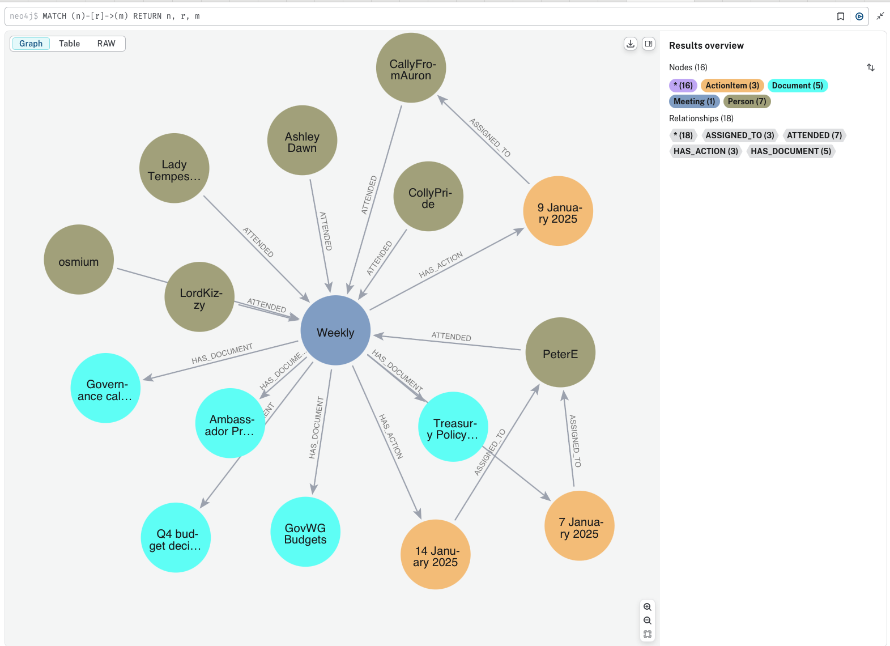

# SingularityNET Meeting Data Graph Database

[](https://www.python.org)
[](https://neo4j.com)
[](https://cursor.sh)
[](https://opensource.org/licenses/MIT)
[](https://github.com/username/repository/graphs/commit-activity)


## Table of Contents
- [Overview](#overview)
  - [Key Features](#key-features)
  - [Benefits](#benefits)
- [Installation](#installation)
  - [Prerequisites](#prerequisites)
  - [Setup](#setup)
  - [Configuration](#configuration)
- [Graph Schema Overview](#graph-schema-overview)
  - [Node Types](#node-types)
  - [Relationships](#relationships)
  - [Properties](#properties)
- [Usage](#usage)
  - [Basic Queries](#basic-queries)
  - [Advanced Analysis](#advanced-analysis)
  - [Common Use Cases](#common-use-cases)
- [Query Examples](#query-examples)
  - [Meeting Analysis](#meeting-analysis)
  - [Participant Interactions](#participant-interactions)
  - [Decision Tracking](#decision-tracking)
  - [Action Item Analysis](#action-item-analysis)
- [Best Practices](#best-practices)
  - [Data Entry](#data-entry)
  - [Query Optimization](#query-optimization)
  - [Performance Tips](#performance-tips)
- [Contributing](#contributing)
  - [Development Setup](#development-setup)
  - [Submission Guidelines](#submission-guidelines)
- [License](#license)

## Overview

A graph-based system for analyzing meeting relationships, participant interactions, and decision flows.

This utility imports SingularityNET meeting data into a Neo4j Aura graph database, creating a queryable graph structure of meetings, participants, documents, action items, and metadata.

## Data Model Visualization



*Figure 1: Graph model showing relationships between Meetings and related entities*

---

## Features

- **Meeting Data Import**: Converts JSON meeting data into a graph structure
- **Graph Relationships**: Creates connections between meetings, people, documents, and tasks
- **Environment Variable Configuration**: Securely loads Neo4j credentials from `.env`
- **Error Handling**: Comprehensive error logging for troubleshooting

---

## Prerequisites

Before diving into the analysis, ensure you have the following prerequisites installed and configured:

- Python 3.8 or later
- Neo4j Aura database instance
- Required Python packages:
  ```bash
  pip install neo4j python-dotenv
  ```

---

## Setup

1. **Clone and Configure**:
   ```bash
   git clone <repository-url>
   cd <repository-directory>
   ```

2. **Create `.env` File**:
   ```ini
   NEO4J_URI=neo4j+s://<your-database-uri>
   NEO4J_USERNAME=neo4j
   NEO4J_PASSWORD=<your-password>
   ```

3. **Prepare Meeting Data**:
   Place your meeting data in `snet-data.json` following this structure:
   ```json
   {
       "meeting_id": [{
           "workgroup": "Governance Workgroup",
           "meetingInfo": {
               "name": "Weekly",
               "date": "2025-01-07",
               "host": "Host Name",
               "documenter": "Documenter Name",
               "peoplePresent": "Person1, Person2, Person3",
               "purpose": "Meeting Purpose",
               "workingDocs": [
                   {"title": "Doc Title", "link": "Doc URL"}
               ]
           },
           "agendaItems": [
               {
                   "status": "carry over",
                   "narrative": "Discussion narrative...",
                   "actionItems": [
                       {
                           "text": "Action Description",
                           "assignee": "Person Name",
                           "dueDate": "2025-01-14",
                           "status": "todo"
                       }
                   ],
                   "decisionItems": [
                       {
                           "decision": "Decision description",
                           "rationale": "Reasoning behind decision",
                           "opposing": "none",
                           "effect": "affectsOnlyThisWorkgroup"
                       }
                   ],
                   "discussionPoints": [
                       "Point 1",
                       "Point 2"
                   ]
               }
           ],
           "tags": {
               "topicsCovered": "Topic1, Topic2, Topic3",
               "emotions": "Productive, Collaborative"
           }
       }]
   }
   ```

---

## Graph Data Model

### Nodes
- **Meeting**: Contains meeting metadata (workgroup, date, host, topics, emotions)
- **Person**: Represents meeting participants
- **Document**: Working documents referenced in meetings
- **AgendaItem**: Meeting agenda items with status and narrative
- **ActionItem**: Tasks assigned during meetings
- **DiscussionPoint**: Points discussed in agenda items
- **Decision**: Decisions made during the meeting
- **Topic**: Topics covered in the meeting
- **Emotion**: Emotional context or tone of the meeting

### Relationships
- `(Person)-[:ATTENDED]->(Meeting)`
- `(Meeting)-[:HAS_DOCUMENT]->(Document)`
- `(Meeting)-[:HAS_AGENDA_ITEM]->(AgendaItem)`
- `(AgendaItem)-[:HAS_ACTION]->(ActionItem)`
- `(ActionItem)-[:ASSIGNED_TO]->(Person)`
- `(AgendaItem)-[:INCLUDES_DISCUSSION]->(DiscussionPoint)`
- `(AgendaItem)-[:MADE_DECISION]->(Decision)`
- `(Meeting)-[:COVERS_TOPIC]->(Topic)`
- `(Meeting)-[:HAS_EMOTION]->(Emotion)`

### Example Queries
```cypher
// View action items with their meeting context
MATCH (m:Meeting)-[:HAS_ACTION]->(act:ActionItem)-[:ASSIGNED_TO]->(p:Person)
RETURN m.date,
       m.workgroup,
       act.text as action,
       p.name as assignee,
       act.dueDate,
       act.status;

// Alternative view including agenda items when available
MATCH (m:Meeting)
OPTIONAL MATCH (m)-[:HAS_ACTION]->(act:ActionItem)-[:ASSIGNED_TO]->(p:Person)
RETURN m.date,
       m.workgroup,
       collect({
           action: act.text,
           assignee: p.name,
           dueDate: act.dueDate,
           status: act.status
       }) as actions;
```

### Graph Overview Query
```cypher
// Get a complete view of the meeting graph structure
MATCH (m:Meeting)
OPTIONAL MATCH (m)-[r1:HAS_ACTION]->(act:ActionItem)-[r2:ASSIGNED_TO]->(p:Person)
OPTIONAL MATCH (m)-[r3:HAS_DOCUMENT]->(d:Document)
OPTIONAL MATCH (m)-[r4:MADE_DECISION]->(dec:Decision)
OPTIONAL MATCH (m)-[r5:COVERS_TOPIC]->(t:Topic)
OPTIONAL MATCH (m)-[r6:HAS_EMOTION]->(e:Emotion)
OPTIONAL MATCH (att:Person)-[r7:ATTENDED]->(m)
RETURN *;

// Overview with correct counting syntax
MATCH (m:Meeting)
OPTIONAL MATCH (m)-[:HAS_ACTION]->(a:ActionItem)
OPTIONAL MATCH (m)-[:MADE_DECISION]->(d:Decision)
OPTIONAL MATCH (m)-[:COVERS_TOPIC]->(t:Topic)
OPTIONAL MATCH (p:Person)-[:ATTENDED]->(m)
OPTIONAL MATCH (m)-[:HAS_DOCUMENT]->(doc:Document)
RETURN m.date,
       m.workgroup,
       count(DISTINCT a) as action_count,
       count(DISTINCT d) as decision_count,
       count(DISTINCT t) as topic_count,
       count(DISTINCT p) as attendee_count,
       count(DISTINCT doc) as document_count
ORDER BY m.date DESC;
```

The first query visualizes the complete graph structure, while the second query provides a numerical overview of all connected entities for each meeting.

### Graph Structure Analysis

#### 1. Node Label Analysis
```cypher
// Basic node count by label
MATCH (n)
RETURN distinct labels(n) as Node_Type,
       count(*) as Count
ORDER BY Count DESC;

// Nodes with their properties
MATCH (n)
WITH labels(n)[0] as Node_Type, 
     collect(DISTINCT keys(n)) as Properties,
     count(*) as Count
RETURN Node_Type,
       Properties,
       Count
ORDER BY Count DESC;

// Isolated nodes (nodes without relationships)
MATCH (n)
WHERE NOT (n)--()
RETURN labels(n) as Node_Type,
       count(*) as Isolated_Count;
```

#### 2. Relationship Analysis
```cypher
// Direct relationships between node types
MATCH (a)-[r]->(b)
RETURN DISTINCT
    labels(a)[0] as Source_Type,
    type(r) as Relationship,
    labels(b)[0] as Target_Type,
    count(*) as Frequency
ORDER BY Frequency DESC;

// Meeting-centric relationships
MATCH (m:Meeting)
OPTIONAL MATCH (m)-[r]->(target)
RETURN DISTINCT
    type(r) as Relationship_Type,
    labels(target)[0] as Connected_To,
    count(*) as Connection_Count
ORDER BY Connection_Count DESC;

// Person interactions
MATCH (p:Person)
OPTIONAL MATCH (p)-[r]-(connected)
RETURN DISTINCT
    type(r) as Relationship_Type,
    labels(connected)[0] as Connected_To,
    count(*) as Interaction_Count,
    collect(DISTINCT p.name)[0..5] as Sample_People
ORDER BY Interaction_Count DESC;
```

#### 3. Graph Schema
```cypher
// Complete graph schema
CALL db.schema.visualization();

// Custom schema view
MATCH (a)-[r]->(b)
WITH labels(a)[0] as Source_Label,
     type(r) as Relationship_Type,
     labels(b)[0] as Target_Label,
     count(*) as Frequency,
     collect(DISTINCT keys(a)) as Source_Properties,
     collect(DISTINCT keys(b)) as Target_Properties
RETURN Source_Label,
       Source_Properties,
       Relationship_Type,
       Target_Label,
       Target_Properties,
       Frequency
ORDER BY Source_Label, Relationship_Type;

// Property analysis
MATCH (n)
WITH labels(n)[0] as Node_Type,
     keys(n) as Properties
UNWIND Properties as Property
RETURN DISTINCT
    Node_Type,
    collect(DISTINCT Property) as Property_Keys,
    count(DISTINCT Property) as Property_Count
ORDER BY Node_Type;
```

These queries provide:
1. **Label Analysis**:
   - Basic node counts
   - Property analysis for each node type
   - Detection of isolated nodes

2. **Relationship Analysis**:
   - Direct connections between different node types
   - Meeting-centric view of relationships
   - Person interaction patterns

3. **Schema Information**:
   - Built-in schema visualization
   - Custom schema view with properties
   - Property key analysis

Use these queries to understand:
- Data distribution across node types
- Connection patterns
- Data model completeness
- Potential anomalies or isolated data

### Specialized Graph Analysis

#### 1. Node-Specific Queries
```cypher
// Meeting Analysis
MATCH (m:Meeting)
OPTIONAL MATCH (p:Person)-[:ATTENDED]->(m)
WITH m.workgroup as workgroup,
     m.date as meeting_date,
     count(DISTINCT p) as attendee_count
RETURN workgroup,
       count(*) as meeting_count,
       min(meeting_date) as first_meeting,
       max(meeting_date) as last_meeting,
       avg(attendee_count) as avg_attendance
ORDER BY meeting_count DESC;

// Alternative detailed view
MATCH (m:Meeting)
OPTIONAL MATCH (p:Person)-[:ATTENDED]->(m)
RETURN m.workgroup as workgroup,
       m.date as meeting_date,
       count(DISTINCT p) as attendee_count,
       collect(p.name) as attendees
ORDER BY m.date DESC;
```

#### 2. Temporal Analysis
```cypher
// Meeting Frequency Over Time
MATCH (m:Meeting)
WITH date(m.date) as meeting_date,
     m.workgroup as workgroup
RETURN workgroup,
       meeting_date.quarter as quarter,
       meeting_date.year as year,
       count(*) as meeting_count
ORDER BY year, quarter;

// Decision Timeline
MATCH (m:Meeting)-[:MADE_DECISION]->(d:Decision)
WITH date(m.date) as decision_date,
     d.effect as effect_type,
     count(*) as decision_count
RETURN decision_date,
       effect_type,
       decision_count
ORDER BY decision_date;

// Action Item Tracking
MATCH (m:Meeting)-[:HAS_ACTION]->(a:ActionItem)
WHERE a.dueDate IS NOT NULL
WITH a.dueDate as original_date,
     a.status as status
RETURN original_date as due_date,
       status,
       count(*) as action_count
ORDER BY original_date;

// Action Items with Status Distribution
MATCH (m:Meeting)-[:HAS_ACTION]->(a:ActionItem)
RETURN a.status as status,
       count(*) as action_count,
       collect(a.dueDate) as due_dates
ORDER BY action_count DESC;

// Action Items by Meeting
MATCH (m:Meeting)-[:HAS_ACTION]->(a:ActionItem)
RETURN m.date as meeting_date,
       count(*) as action_count,
       collect({
           text: a.text,
           status: a.status,
           dueDate: a.dueDate
       }) as actions
ORDER BY m.date DESC;
```

#### 3. Data Quality Checks
```cypher
// Missing Required Properties
MATCH (m:Meeting)
WHERE m.date IS NULL 
   OR m.workgroup IS NULL
   OR m.host IS NULL
RETURN 'Meeting' as Node_Type,
       m.id as ID,
       [k in keys(m) WHERE m[k] IS NULL] as Null_Properties;

// Comprehensive Property Check
MATCH (n)
WITH n, labels(n)[0] as Node_Type
WITH n, Node_Type,
     CASE Node_Type
         WHEN 'Meeting' THEN ['date', 'workgroup', 'host']
         WHEN 'Person' THEN ['name']
         WHEN 'ActionItem' THEN ['text', 'status', 'assignee']
         WHEN 'Decision' THEN ['decision', 'effect']
         ELSE []
     END as required_properties
WITH n, Node_Type, required_properties,
     [prop in required_properties WHERE n[prop] IS NULL] as missing_properties
WHERE size(missing_properties) > 0
RETURN Node_Type,
       n.id as ID,
       missing_properties,
       properties(n) as existing_properties;

// Empty String Properties
MATCH (n)
WITH n, labels(n)[0] as Node_Type,
     [k in keys(n) WHERE n[k] = ''] as empty_properties
WHERE size(empty_properties) > 0
RETURN Node_Type,
       n.id as ID,
       empty_properties;
```

These queries help you:

1. **Node-Specific Analysis**:
   - Track meeting patterns by workgroup
   - Monitor participant engagement
   - Analyze document usage

2. **Temporal Analysis**:
   - View meeting frequency trends
   - Track decision-making patterns
   - Monitor action item timelines

3. **Data Quality**:
   - Find missing required properties
   - Identify orphaned nodes
   - Detect date format issues
   - Find potential duplicates
   - Check relationship integrity

Use these queries to:
- Monitor participation patterns
- Track workgroup activity
- Identify data quality issues
- Ensure data consistency

### Graph Schema Overview
```cypher
// Schema-level view
MATCH (a)-[r]->(b)
WITH DISTINCT
    labels(a)[0] as Source_Type,
    type(r) as Relationship,
    labels(b)[0] as Target_Type
RETURN 
    Source_Type + ' -[' + Relationship + ']-> ' + Target_Type as Graph_Structure
ORDER BY Source_Type, Relationship;
```

This query shows the high-level structure of the graph, displaying all node types and how they are connected through relationships.

### Understanding Node Degree

Node Degree is a fundamental metric in graph analysis that measures how connected a node is. Think of it as counting a node's relationships.

```cypher
// Basic Node Degree Analysis
MATCH (n)
OPTIONAL MATCH (n)-->(out)
OPTIONAL MATCH (n)<--(in)
OPTIONAL MATCH (n)--(total)
RETURN 
    labels(n)[0] as NodeType,
    CASE labels(n)[0]
        WHEN 'Person' THEN n.name
        WHEN 'Meeting' THEN n.workgroup + ' (' + n.date + ')'
        ELSE coalesce(n.title, n.text, '')
    END as NodeName,
    count(DISTINCT out) as OutDegree,   // Outgoing relationships
    count(DISTINCT in) as InDegree,     // Incoming relationships
    count(DISTINCT total) as TotalDegree // All relationships
ORDER BY TotalDegree DESC;
```

### Types of Degree:

1. **Out-Degree**
   - Number of outgoing relationships
   - Example: Person -[ATTENDED]-> Meeting
   - Shows: How many meetings a person attended

2. **In-Degree**
   - Number of incoming relationships
   - Example: Meeting <-[ATTENDED]- Person
   - Shows: How many people attended a meeting

3. **Total Degree**
   - Total number of relationships (both directions)
   - Shows: Overall connectivity of a node

### Real-World Examples:

```cypher
// Example: Meeting Attendance Degree
MATCH (m:Meeting)
OPTIONAL MATCH (m)<-[att:ATTENDED]-(p:Person)
OPTIONAL MATCH (m)-[act:HAS_ACTION]->(a:ActionItem)
RETURN 
    m.workgroup + ' (' + m.date + ')' as Meeting,
    count(DISTINCT p) as Attendees,      // In-Degree for ATTENDED
    count(DISTINCT a) as ActionItems,    // Out-Degree for HAS_ACTION
    count(DISTINCT p) + count(DISTINCT a) as TotalConnections
ORDER BY TotalConnections DESC;

// Example: Person Activity Degree
MATCH (p:Person)
OPTIONAL MATCH (p)-[att:ATTENDED]->(m:Meeting)
OPTIONAL MATCH (p)<-[assigned:ASSIGNED_TO]-(a:ActionItem)
RETURN 
    p.name as Person,
    count(DISTINCT m) as MeetingsAttended,    // Out-Degree for ATTENDED
    count(DISTINCT a) as AssignedActions,     // In-Degree for ASSIGNED_TO
    count(DISTINCT m) + count(DISTINCT a) as TotalActivity
ORDER BY TotalActivity DESC;
```

### Significance:

1. **High Degree Nodes**
   - Meetings with many attendees
   - People involved in many meetings
   - Topics discussed frequently

2. **Low Degree Nodes**
   - One-off meetings
   - Occasional participants
   - Rarely discussed topics

3. **Business Insights**
   - Identify key participants
   - Find important meetings
   - Discover central topics

### Relationship Definitions

1. **Person -> Meeting**
   - `ATTENDED`: Indicates a person was present at a meeting
   - Direction: Person to Meeting
   - Example: `(Person {name: 'John'}) -[:ATTENDED]-> (Meeting {date: '2025-01-01'})`

2. **Meeting -> ActionItem**
   - `HAS_ACTION`: Links a meeting to tasks or actions decided during the meeting
   - Direction: Meeting to ActionItem
   - Example: `(Meeting) -[:HAS_ACTION]-> (ActionItem {text: 'Review proposal'})`

3. **ActionItem -> Person**
   - `ASSIGNED_TO`: Shows who is responsible for completing an action item
   - Direction: ActionItem to Person
   - Example: `(ActionItem {text: 'Review'}) -[:ASSIGNED_TO]-> (Person {name: 'Jane'})`

4. **Meeting -> Document**
   - `HAS_DOCUMENT`: Links a meeting to its related documents
   - Direction: Meeting to Document
   - Example: `(Meeting) -[:HAS_DOCUMENT]-> (Document {title: 'Proposal v1'})`

5. **Meeting -> Decision**
   - `MADE_DECISION`: Connects a meeting to decisions made during it
   - Direction: Meeting to Decision
   - Example: `(Meeting) -[:MADE_DECISION]-> (Decision {decision: 'Approved proposal'})`

6. **Meeting -> Topic**
   - `COVERS_TOPIC`: Shows topics discussed in a meeting
   - Direction: Meeting to Topic
   - Example: `(Meeting) -[:COVERS_TOPIC]-> (Topic {name: 'Governance'})`

7. **Meeting -> Emotion**
   - `HAS_EMOTION`: Indicates the emotional context or tone of a meeting
   - Direction: Meeting to Emotion
   - Example: `(Meeting) -[:HAS_EMOTION]-> (Emotion {name: 'Productive'})`

### Key Points:
- All relationships are directed (one-way)
- Meetings are the central node type, connecting to most other nodes
- Action Items create a chain from Meeting through Action to Person
- Topics and Emotions provide context and categorization
- Documents track meeting materials and references

### Graph Metrics Relationships

```cypher
// 1. Degree and Path Length
MATCH (n)
OPTIONAL MATCH (n)-[r]-(neighbor)
WITH n, 
     count(DISTINCT neighbor) as degree,
     labels(n)[0] as nodeType
MATCH path = (n)-[*1..3]-(connected)
WITH n, nodeType, degree, connected, path
RETURN 
    nodeType,
    CASE nodeType
        WHEN 'Person' THEN n.name
        WHEN 'Meeting' THEN n.workgroup
        ELSE coalesce(n.title, n.text, '')
    END as nodeName,
    degree as direct_connections,
    count(DISTINCT connected) as reachable_nodes,
    avg(length(path)) as avg_path_length
ORDER BY degree DESC
LIMIT 10;

// 2. Degree Distribution
MATCH (n)
OPTIONAL MATCH (n)-[r]-()
WITH labels(n)[0] as nodeType,
     count(DISTINCT r) as degree
RETURN 
    nodeType,
    degree as connectivity,
    count(*) as node_count
ORDER BY nodeType, degree;

// 3. Clustering Analysis
MATCH (n)-[r1]-(neighbor)
WITH n, 
     collect(DISTINCT neighbor) as neighbors,
     count(DISTINCT neighbor) as degree
WHERE degree > 1
MATCH (n1)-[r2]-(n2)
WHERE n1 IN neighbors 
AND n2 IN neighbors
AND id(n1) < id(n2)
RETURN 
    labels(n)[0] as nodeType,
    degree as node_degree,
    count(*) as neighbor_connections,
    (2.0 * count(*)) / (degree * (degree - 1)) as clustering_coefficient
ORDER BY clustering_coefficient DESC;
```

### Visualization Recommendations

1. **Node Degree Visualization**
```cypher
// Data for degree-based visualization
MATCH (n)
OPTIONAL MATCH (n)-[r]-()
WITH n,
     labels(n)[0] as nodeType,
     count(DISTINCT r) as degree
RETURN 
    nodeType,
    CASE nodeType
        WHEN 'Person' THEN n.name
        WHEN 'Meeting' THEN n.workgroup + ' (' + n.date + ')'
        ELSE coalesce(n.title, n.text, '')
    END as label,
    degree as size
ORDER BY degree DESC;
```
**Visualization Tips:**
- Use node size to represent degree
- Color nodes by type (Person, Meeting, etc.)
- Add tooltips showing exact degree values
- Consider force-directed layout

2. **Path Length Visualization**
```cypher
// Data for path visualization
MATCH path = (start)-[*1..3]-(end)
WHERE labels(start)[0] = 'Person'
AND labels(end)[0] = 'Person'
AND start <> end
RETURN 
    start.name as source,
    end.name as target,
    length(path) as distance,
    [node in nodes(path) | labels(node)[0]] as node_types
ORDER BY distance
LIMIT 100;
```
**Visualization Tips:**
- Use edge length to show path distance
- Color edges by path length
- Show intermediate nodes
- Consider hierarchical layout

3. **Clustering Visualization**
```cypher
// Data for cluster visualization
MATCH (n)-[r1]-(neighbor)
WITH n, 
     collect(DISTINCT neighbor) as neighbors,
     count(DISTINCT neighbor) as degree
WHERE degree > 1
MATCH (n1)-[r2]-(n2)
WHERE n1 IN neighbors 
AND n2 IN neighbors
AND id(n1) < id(n2)
RETURN 
    labels(n)[0] as group,
    n.name as node,
    count(*) as cluster_size,
    collect(DISTINCT n1.name + '-' + n2.name) as connections
ORDER BY cluster_size DESC;
```
**Visualization Tips:**
- Group nodes by clustering coefficient
- Use different colors for clusters
- Show connection density
- Consider circular layout for clusters

### Recommended Visualization Tools:

1. **Neo4j Bloom**
   - Built-in visualization
   - Interactive exploration
   - Custom styling rules
   - Real-time updates

2. **Graph Data Visualization Tools**
   - D3.js for custom web visualizations
   - Gephi for detailed analysis
   - Graphistry for large-scale graphs
   - Cytoscape for biological-style networks

3. **Best Practices**
   - Limit node count for clarity
   - Use consistent color schemes
   - Add interactive filters
   - Include legend/key
   - Enable zoom/pan
   - Show relationship labels on hover

### Visualization Use Cases:

1. **Executive Dashboards**
   - High-level metrics
   - Key player identification
   - Trend visualization

2. **Analysis Views**
   - Detailed connections
   - Path analysis
   - Cluster identification

3. **Operational Views**
   - Real-time updates
   - Action item tracking
   - Meeting connections

## Usage

Run the importer:
```bash
python neo.py
```

### Example Queries

View all relationships:
```cypher
MATCH (n)-[r]->(m)
RETURN n, r, m
```

Show meetings and participants:
```cypher
MATCH (p:Person)-[:ATTENDED]->(m:Meeting)
RETURN m.workgroup, m.date, collect(p.name) as participants
```

View action items and assignees:
```cypher
MATCH (m:Meeting)-[:HAS_ACTION]->(a:ActionItem)-[:ASSIGNED_TO]->(p:Person)
RETURN m.date, a.text, p.name, a.status, a.dueDate
```

View meeting structure:
```cypher
MATCH (p:Person)-[:ATTENDED]->(m:Meeting)
RETURN m.workgroup, m.date, collect(p.name) as participants
```

View meeting agenda items and decisions:
```cypher
MATCH (m:Meeting)-[:HAS_AGENDA_ITEM]->(a:AgendaItem)-[:MADE_DECISION]->(d:Decision)
RETURN m.date, a.status, d.decision, d.rationale
```

View meeting metadata:
```cypher
MATCH (m:Meeting)-[:COVERS_TOPIC]->(t:Topic)
RETURN m.date, m.workgroup, collect(t.name) as topics

MATCH (m:Meeting)-[:HAS_EMOTION]->(e:Emotion)
RETURN m.date, m.workgroup, collect(e.name) as emotions

MATCH (m:Meeting)
OPTIONAL MATCH (m)-[:COVERS_TOPIC]->(t:Topic)
OPTIONAL MATCH (m)-[:HAS_EMOTION]->(e:Emotion)
RETURN m.date, m.workgroup, 
       collect(DISTINCT t.name) as topics,
       collect(DISTINCT e.name) as emotions
```

---

## Files
- `neo.py`: Database connection and data import logic
- `snet-data.json`: Source meeting data
- `.env`: Neo4j credentials (not tracked in git)
- `.gitignore`: Git ignore rules

---

## Notes

- Ensure `.env` is in `.gitignore` to protect credentials
- Meeting data should follow the specified JSON structure
- Requires active Neo4j Aura instance

---

## License

MIT License
